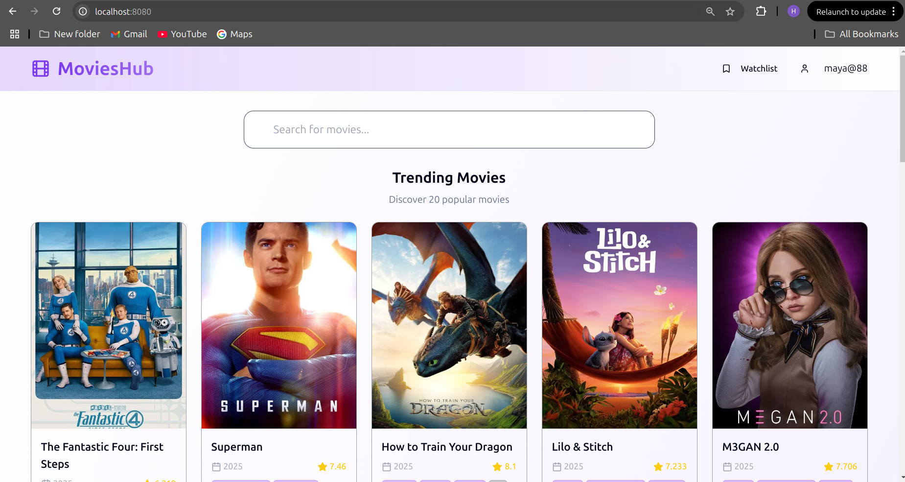
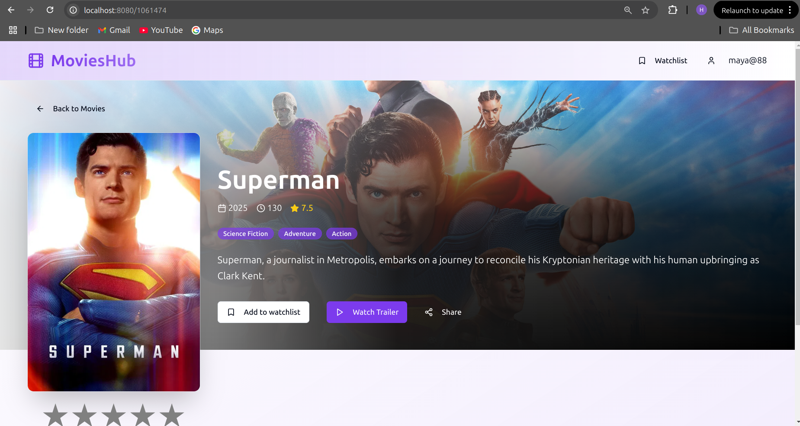

# 🎬 MovieHub

MovieHub is a full-stack movie application that allows users to browse, search, and interact with movie-related data. Built with modern technologies, it features a responsive and sleek UI, seamless API integration, and robust backend services.

Live server link - [Moviehub](https://movies-hub-project.netlify.app)

## 🚀 Tech Stack

### 🖥️ Frontend
- **React JS** – Component-based UI
- **TypeScript** – Strongly-typed language for better scalability
- **Tailwind CSS** – Utility-first CSS framework for styling

### ⚙️ Backend
- **Django** – High-level Python web framework
- **Django REST Framework** – Toolkit for building RESTful APIs
- **PostgreSQL** – Powerful, open source relational database system

## 📦 Features

- 🔍 Browse and search for movies
- 📄 Detailed movie information pages
- ❤️ Add/remove movies to/from favorites or watchlist (if applicable)
- 🧑‍💼 User authentication & authorization (optional)
- 📱 Responsive UI for all devices
- 📊 Efficient API design and data handling
- 🧠 AI-powered personality-based summary based on user preferences

## Installation & Setup 

### Clone the repo 

```bash
git clone https://github.com/yourusername/moviehub.git
cd moviehub`
```

## Backend Setup (Django + PostgreSQL)

1. Navigate to the `movie-hub-backend` folder 

```bash
cd movie-hub-backend
```

2. create a virtual environment and activate it 

```bash
python -m venv venv 
venv\Scripts\activate
```
3. Install dependencies 

```bash
pip install -r requirements.txt
```

4. Configure your PostgreSQL database settings in moviehub/settings.py 
   Run Migrations and start the backend Server 

```bash
python manage.py makemigrations
python manage.py migrate
python manage.py runserver
```


## Frontend Setup (React + Typescript + TailwindCSS)


1. Navigate to `movie-hub-fronted` folder

```bash

cd movie-hub-frontend

```

2. Install dependencies

```bash

npm install

```

3. start the development server

```bash 

npm run dev

```

## Screenshots 


### Login 


### Homepage 




### Movie 




### 📄 License

This project is licensed under the MIT License.


### 🤝 Contributing

Pull requests are welcome! For major changes, please open an issue first to discuss what you'd like to change.


### 🙌 Acknowledgements

TMDB for movie data
Open Source libraries and frameworks


